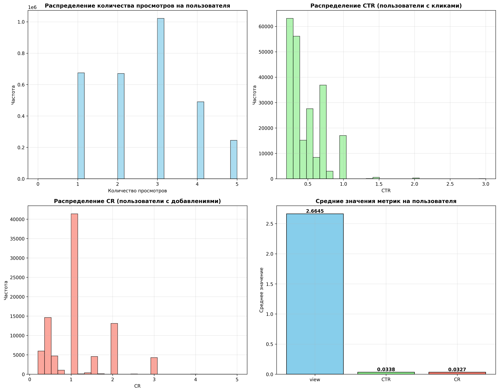
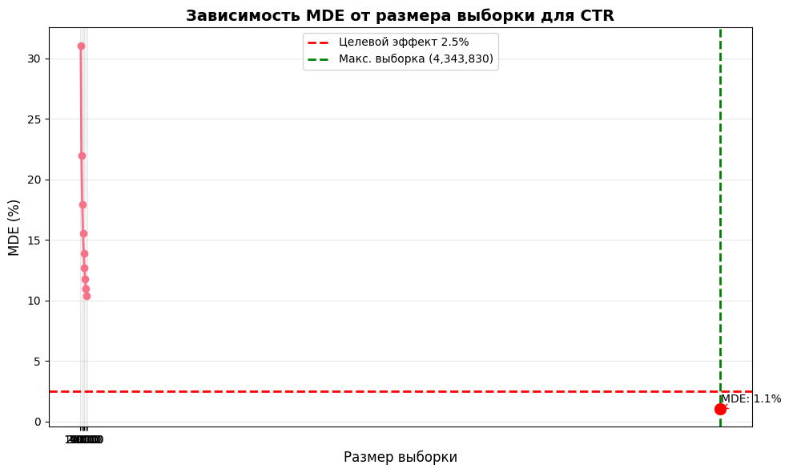
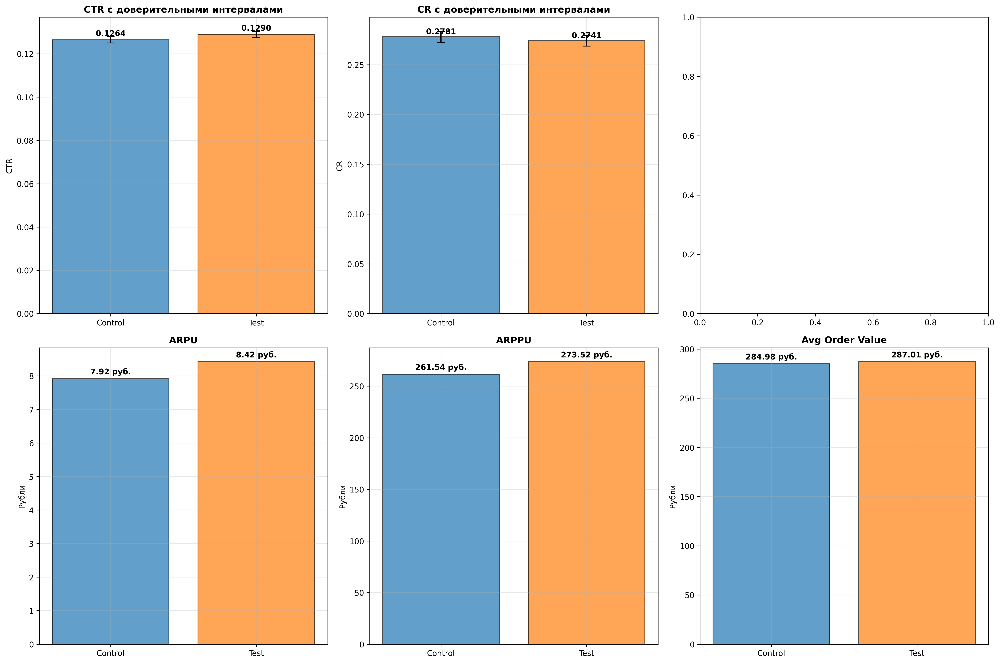
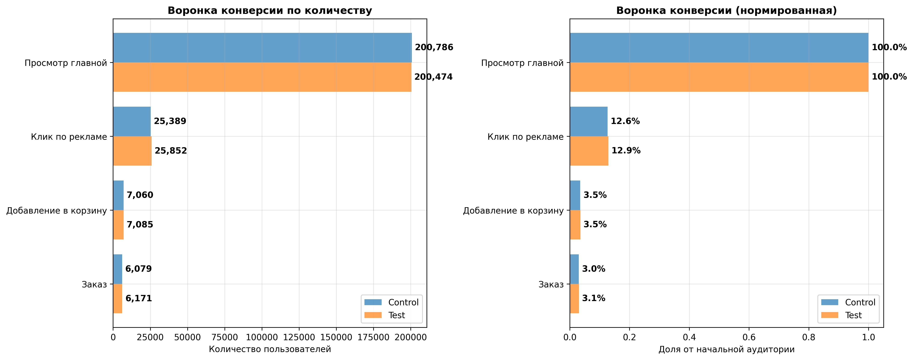

# Анализ А/Б теста: Изменение расположения рекламного блока

## Часть 1: Дизайн эксперимента

### 1.1. Анализ пользовательского поведения до эксперимента

**Ключевые метрики до эксперимента:**
- Глобальный CTR: 0.0448
- Глобальный CR: 0.4018
- Среднее количество просмотров на пользователя: 2.66
- Всего пользователей в исторических данных: 3,102,736

### 1.2. Расчет MDE и размера выборки

**Расчет параметров эксперимента:**
- Среднесуточные пользователи: 3,102,736
- Недельная аудитория: 21,719,152
- Максимальная выборка (20%): 4,343,830
- MDE для максимальной выборки: 1.05%
- Статус: ✓ Достаточная мощность

## Часть 2: Результаты эксперимента

### 2.1. Распределение пользователей по группам

- Контрольная группа: 489,858 пользователей
- Тестовая группа: 491,652 пользователей
- Общее количество: 981,510 пользователей

### 2.2. Статистический анализ

**Результаты статистических тестов:**
- CTR: z-score = 2.3784, p-value = 0.0174 ✓
- CR: z-score = -1.0160, p-value = 0.3096 ✗

**Изменение ключевых метрик:**
- CTR: 0.1264 → 0.1290 (+1.98%)
- CR: 0.2781 → 0.2741 (-1.44%)
- ARPU: 7.92 руб. → 8.42 руб. (+6.33%)

### 2.3. Анализ воронки конверсии

| Этап                 |   Control |   Test |   Конверсия Control |   Конверсия Test |
|:---------------------|----------:|-------:|--------------------:|-----------------:|
| Просмотр главной     |    200786 | 200474 |           1         |        1         |
| Клик по рекламе      |     25389 |  25852 |           0.126448  |        0.128954  |
| Добавление в корзину |      7060 |   7085 |           0.0351618 |        0.0353412 |
| Заказ                |      6079 |   6171 |           0.030276  |        0.030782  |

## Заключение и рекомендации

### ✅ **ЭКСПЕРИМЕНТ УСПЕШЕН**

### Рекомендация:

Изменение расположения рекламного блока показало статистически значимое улучшение CTR на +1.98%. Рекомендуется внедрить изменение для всех пользователей.

### Дополнительные рекомендации:
1. Провести сегментный анализ для выявления групп пользователей, наиболее чувствительных к изменению
2. Оценить долгосрочное влияние на retention и LTV
3. Проанализировать возможное влияние на другие бизнес-метрики
4. Рассчитать ROI от внедрения изменения