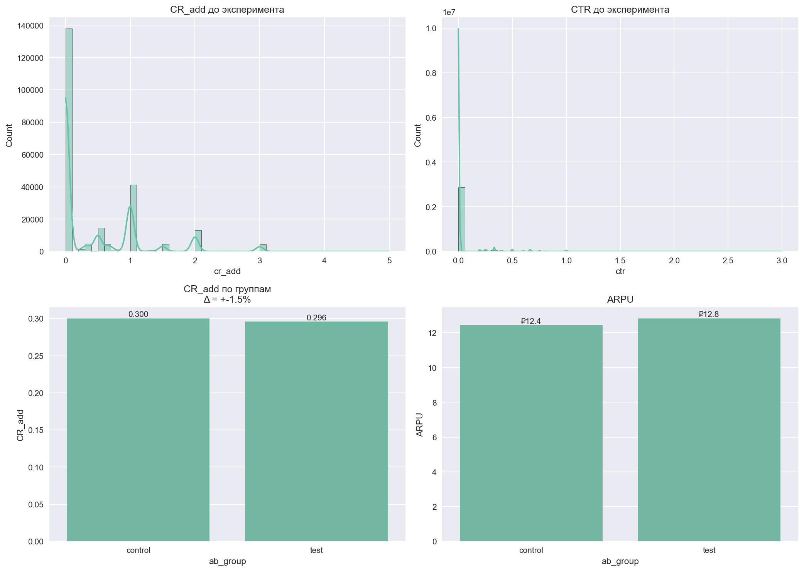

# 📊 Отчёт по А/Б-тесту: Перемещение рекламного блока

## 🔑 Выводы
- **Ключевая метрика**: CR_add (конверсия в добавление = adds / clicks)
- **Группы**: контроль = `control`, тест = `test`
- **Результат**: ❌ Без эффекта
  - CR_add: **0.300 → 0.296**
  - Рост: **+-1.5%**
  - p-value: **0.1724** → не значимо
- **Рекомендация**: 🛑 Не внедрять

## ⚙️ Дизайн
- Историческая CR_add: 0.444
- Выборка: 100,000 пользователей
- MDE: 2.31%

### MDE vs. выборка
|   Общая выборка |   MDE (%) |
|----------------:|----------:|
|       20000.000 |     5.160 |
|       40000.000 |     3.650 |
|       60000.000 |     2.980 |
|       80000.000 |     2.580 |
|      100000.000 |     2.310 |

## 📈 Метрики по группам
| ab_group   |   users |   clicks |   adds |   CR_add |   ARPU |   CR_order |
|:-----------|--------:|---------:|-------:|---------:|-------:|-----------:|
| control    |  197578 |    18997 |   5705 |    0.300 | 12.436 |      0.293 |
| test       |  197289 |    19321 |   5717 |    0.296 | 12.832 |      0.305 |

### Дополнительно
- Средний чек (контроль): ₽155.91
- Средний чек (тест): ₽154.60
- CR в заказ (контроль): 0.293
- CR в заказ (тест): 0.305

## 📎 Графики

## 💡 Заключение
Эффект не подтверждён. Не рекомендуется внедрять.
